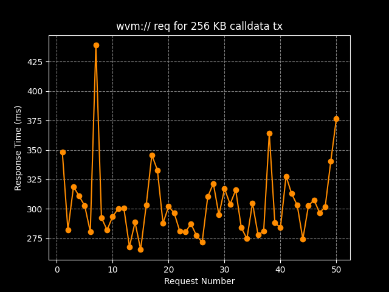

<p align="center">
  <a href="https://wvm.dev">
    
  </a>
</p>

## About
WeaveVM Data Retriever (`wvm://`) is a protocol for retrieving data from WeaveVM network. It leverages the WeaveVM DA layer and Arweave's permanent storage to access and retrieve WeaveVM transaction data through both networks.

## Build & Run

```bash
git clone https://github.com/weaveVM/wvm-data-retriever.git

cd wvm-data-retriever

cargo shuttle run
```

## wvm:// workflow


## Server Methods

### Retrieve calldata associated with an WeaveVM TXID

```bash
curl -X GET https://gateway.wvm.dev/calldata/$WVM_TXID
```

Returns the res in the format as in below. Incase the calldata settled on WeaveVM isn't Borsh-Brotli encoded, the Arweave DA verification is omitted as per the current release.

```rs
pub struct HandlerGetCalldata {
    pub calldata: String,
    pub arweave_block_hash: String,
    pub wvm_block_hash: String,
    pub war_decoded_calldata: Option<String>, // default to Some("")
    pub wvm_data_da: bool,
    pub ar_data_archive: bool,
    pub da_archive_is_equal_data: bool,
}
```

### Retrieve WeaveVM-Archiver JSON decoded calldata

```bash
curl -X GET https://gateway.wvm.dev/war-calldata/$WVM_TXID
```
Returns

```rs
pub struct HandlerGetCalldata {
    pub calldata: String,
    pub arweave_block_hash: String,
    pub wvm_block_hash: String,
    pub war_decoded_calldata: Option<String>, // the decoded JSON representation of `calldata`
    pub wvm_data_da: bool,
    pub ar_data_archive: bool,
    pub da_archive_is_equal_data: bool,
}
```

## Usage as crate

Add `wvm-data-retriever` to your `Cargo.toml` 

```Cargo.toml
[dependencies]
wvm-data-retriever = { git = "https://github.com/weaveVM/wvm-data-retriever" }
```

And in your codebase:

```rust
use wvm_data_retriever::utils::getters::{get_calldata, get_war_calldata};
```


## Benchmarks

### Latency for /calldata

The latency includes the time spent fetching data from WeaveVM RPC and the Arweave gateway, as well as the processing time for Brotli decompression, Borsh deserialization, and data validity verification.



## License
This project is licensed under the [MIT License](./LICENSE)