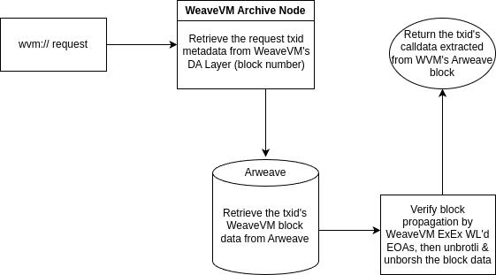

<p align="center">
  <a href="https://wvm.dev">
    
  </a>
</p>

## About
WeaveVM Data Retriever (`wvm://`) is a protocol for retrieving data from WeaveVM network. It leverages the WeaveVM DA layer and Arweave's permanent storage to access and retrieve WeaveVM transaction data through both networks.

## Build & Run

```bash
git clone https://github.com/weaveVM/wvm-data-retriever.git

cd wvm-data-retriever

cargo shuttle run
```

## wvm:// workflow



## Server Methods

### Retrieve calldata associated with an WeaveVM TXID

```bash
curl -X GET https://wvm-data-retriever.shuttleapp.rs/calldata/$WVM_TXID
```

Returns

```rs
pub struct HandlerGetCalldata {
    pub calldata: String,
    pub arweave_block_hash: String,
    pub wvm_block_hash: String,
    pub war_decoded_calldata: String // default to Some("")
}
```

### Retrieve WeaveVM-Archiver JSON decoded calldata

```bash
curl -X GET https://wvm-data-retriever.shuttleapp.rs/war-calldata/$WVM_TXID
```
Returns

```rs
pub struct HandlerGetCalldata {
    pub calldata: String,
    pub arweave_block_hash: String,
    pub wvm_block_hash: String,
    pub war_decoded_calldata: String // the decoded JSON representation of `calldata`
}
```

## License
This project is licensed under the [MIT License](./LICENSE)